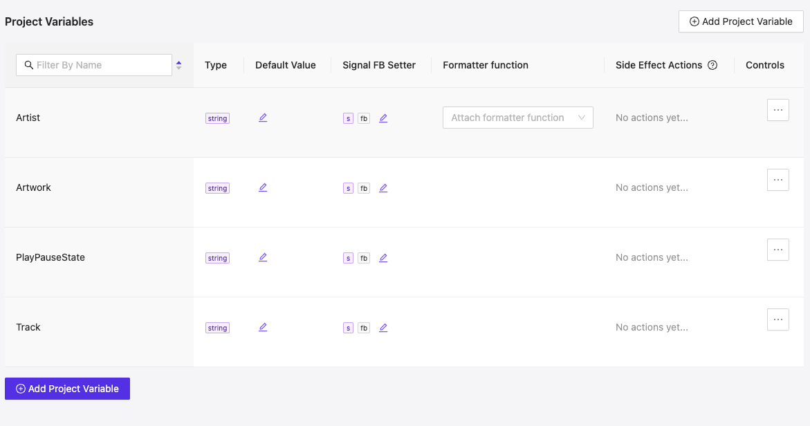
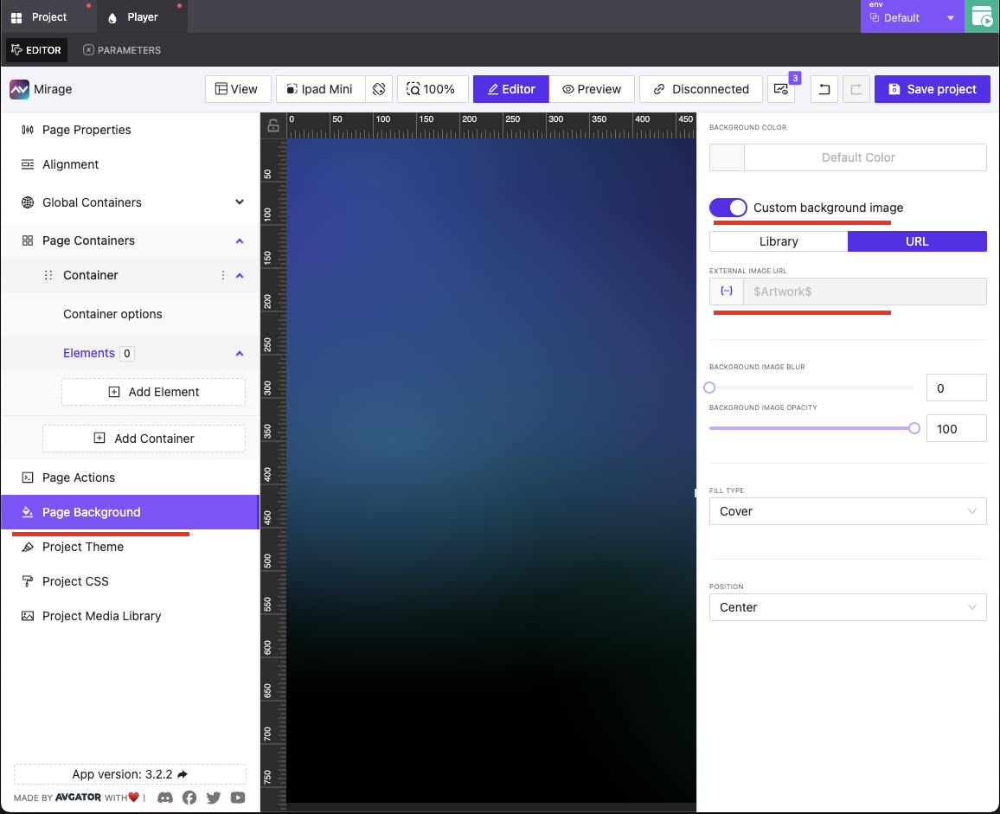
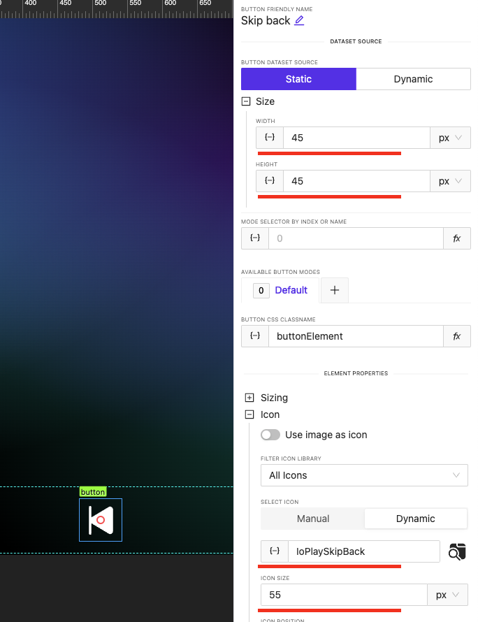
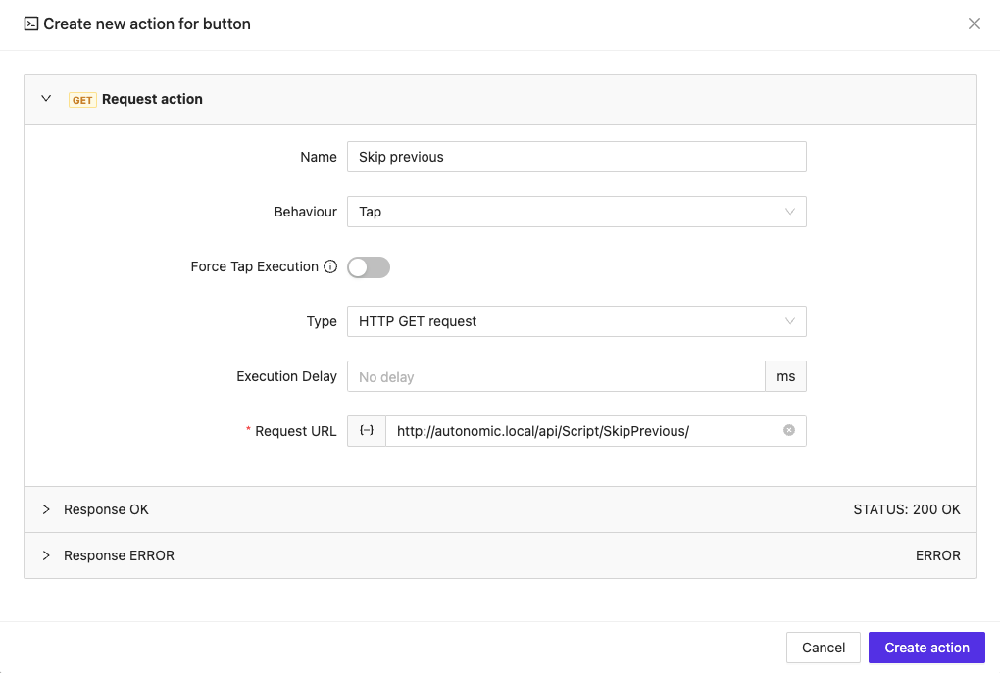
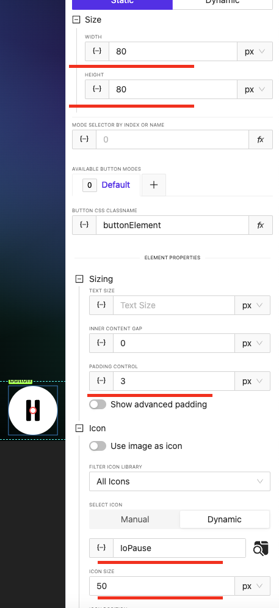
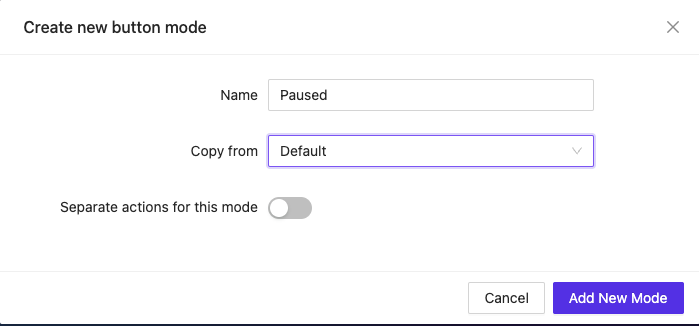

# Autonomic Mirage Media Server Integration Guide

## Before We Start

This document explains how to add a fully functional Autonomic Media Server player application into your AVStudio project using direct HTTP requests without requiring a control system. You'll learn how to create an interactive media player that communicates directly with the Autonomic Media Server to control music playback throughout your environment.

## Understanding Autonomic Media Server Control Protocol and JSON HTTP API

The Autonomic Media Server provides a comprehensive HTTP API that allows direct communication for features like:

- Managing the current playback queue
- Controlling playback (play, pause, skip)
- Adjusting volume
- Browsing music libraries
- Accessing streaming services (Spotify, Tidal, etc.)
- Retrieving album artwork and metadata

Our implementation will utilize the JSON HTTP API, which provides a modern interface for querying and controlling all aspects of the media server.

For comprehensive documentation and the latest API specifications, refer to the official Autonomic developer resources at:
[https://autonomic.atlassian.net/wiki/spaces/ASKB/pages/1509556225/Autonomic+Media+Server+Control+Protocol#JSON-HTTP-API](https://autonomic.atlassian.net/wiki/spaces/ASKB/pages/1509556225/Autonomic+Media+Server+Control+Protocol#JSON-HTTP-API)

## Setting Up Global Variables

To build a responsive media player interface, we'll establish global project variables that will store and display the current playback state and track information.



### Required Project Variables

Create the following variables in your AVStudio project settings:

1. **`Artist`** (string)
   - **Purpose**: Stores the name of the currently playing track's artist
   - **Example value**: "The Beatles"
   - **Usage**: Displayed in the media player's artist field

2. **`Artwork`** (string)
   - **Purpose**: Holds the URL for the current track's album artwork
   - **Example value**: "http://autonomic.local/artwork/12345.jpg"
   - **Usage**: Used as the image source for album artwork display

3. **`PlayPauseState`** (string)
   - **Purpose**: Contains the current playback state (playing vs. paused)
   - **Values**: "0" for paused, "1" for playing
   - **Usage**: Controls which icon (play or pause) is displayed on the play/pause button

4. **`Track`** (string)
   - **Purpose**: Contains the title of the currently playing track
   - **Example value**: "Yesterday"
   - **Usage**: Displayed in the media player's track title field

## Creating the Polling Function

The following function continuously polls the Autonomic Media Server for playback status and updates our global variables with the current track information. Create this function in AVStudio's Project Functions section:

```javascript
function poll() {
    // Self-executing recursive function that continues polling
    (function fetchData() {
        const pollRequest = 'http://autonomic.local/api/';
        const artRequest = 'http://autonomic.local/getArt?guid=';
        
        fetch(pollRequest)
            .then(response => {
                if (!response.ok) {
                    throw new Error('Network response was not ok');
                }
                return response.json();
            })
            .then(data => {
                // Process media server response if events exist
                if (data?.events && data.events.length) {
                    // Extract specific events by name
                    const playStateEvent = data.events.find(event => event.name === "PlayState");
                    const media = data.events.find(event => event.name === "MediaGuid");
                    const artist = data.events.find(event => event.name === "MetaData2");
                    const track = data.events.find(event => event.name === "MetaData3");
                    
                    // Update play/pause state (3 = playing, other values = paused)
                    if (playStateEvent) {
                        if (playStateEvent?.value === 3) {
                            window?.avgatorStudio?.setVariableByName({ name: 'PlayPauseState', value: 0 });
                        } else {
                            window?.avgatorStudio?.setVariableByName({ name: 'PlayPauseState', value: 1 });
                        }
                    }
                    
                    // Update artist information if available
                    if (artist) {
                        window?.avgatorStudio?.setVariableByName({ name: 'Artist', value: artist?.value });
                    }
                    
                    // Update track title information if available
                    if (track) {
                        window?.avgatorStudio?.setVariableByName({ name: 'Track', value: track?.value });
                    }
                    
                    // Update artwork URL if media GUID is available
                    if (media) {
                        window?.avgatorStudio?.setVariableByName({ name: 'Artwork', value: artRequest + media?.value });
                    }
                }
            })
            .catch(error => {
                console.error('There was a problem with the fetch operation:', error);
            })
            .finally(() => {
                // Schedule next poll in 1 second (1000ms)
                setTimeout(fetchData, 1000);
            });
    })();
}
```


### Understanding the Polling Function

This JavaScript function:

1. Creates a self-executing recursive function that maintains ongoing communication with the media server
2. Sends HTTP GET requests to the Autonomic API endpoint every second
3. Processes the returned JSON data to extract current playback information
4. Updates the AVStudio global variables with the latest track metadata
5. Handles errors gracefully to prevent interface disruption
6. Schedules the next polling cycle to ensure continuous updates

The polling approach gives our interface real-time responsiveness to playback changes initiated from any source, whether from our interface or other controllers in the environment.

## Building the Player Interface

### Step 1: Create a New Page

1. Create a new page in your project and name it "Player"
2. This will be the main interface for controlling media playback


### Step 2: Configure Page Properties

1. Set the page background to use the `Artwork` project variable
   - This dynamically displays the current track's album art as the background
   
2. Set page alignment to vertical for proper component stacking


### Step 3: Create Layout Containers

Add two containers to organize your player components:

#### Metadata Container (Top)
1. Create the first container for track information
2. Configure it with:
   - Padding: 15px on all sides
   - Elements alignment: End (bottom)
   - Elements distribution: Start (left)


#### Controls Container (Bottom)
1. Create a second container for playback buttons
2. Configure it with:
   - Height: 100px
   - Padding: 15px on left and right sides


### Step 4: Add Track Information

1. Add a text element to the metadata container
2. Configure it to display:
   - First line: Track name (bind to `Track` project variable)
   - Second line: Artist name (bind to `Artist` project variable)
3. Set appropriate font size, color, and styling to ensure readability over the album art background

!Metadata

### Step 5: Add Playback Controls

#### Skip Back Button
1. Add a button to the controls container
2. Configure the button:
   - Size: 45px × 45px
   - Icon: IoPlaySkipBack (from AVStudio library)
   - Icon size: 55px
   - Padding: 3px
   - Design: Ghost
   - Icon color: White



3. Add an HTTP GET action with URL: `http://autonomic.local/api/Script/SkipPrevious/`


#### Play/Pause Button
1. Add a button between the skip buttons
2. Configure the button:
   - Size: 80px × 80px
   - Icon: IoPause (for the default mode)
   - Icon size: 50px
   - Padding: 3px
   - Background: White
   - Icon color: Black
   - Border radius: 50px (to create a circular button)
   
   
3. Add an HTTP GET action with URL: `http://autonomic.local/api/Script/PlayPause/`

4. Create a second mode for the button:
   
   - Configure the mode selector to use the `PlayPauseState` project variable
   - Add a new mode

   - Set the icon to IoPlay for this mode

- Configure the mode selector to use the `PlayPauseState` project variable


#### Skip Forward Button
1. Clone the Skip Back button
2. Change the icon to IoPlaySkipForward
3. Update the action URL to: `http://autonomic.local/api/Script/SkipNext/`

### Step 6: Set Up Page Actions

1. Open the Page Actions section
2. Add an "On Load" action
3. Select "Run function" and choose the `poll()` function we created earlier
4. This ensures that our polling mechanism starts as soon as the player page loads


## Completed Player

With all components in place and the polling function active, your player will update in real time with the currently playing track information from your Autonomic Media Server. Users can control playback directly from this interface.

